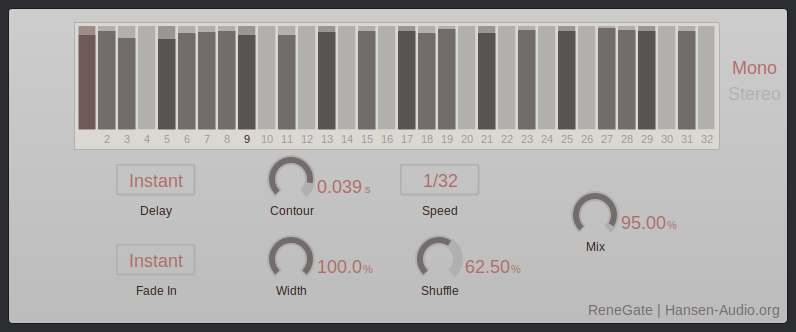

# ReneGate Effect Plug-in

[](https://github.com/hansen-audio/renegate-fx/actions/workflows/cmake.yml)

## Description

A VST 3 trance gate plug-in, which is supposed to work in VST 3 Hosts like Steinberg Cubase/Nuendo/WaveLab, Presonus Studio One, reaper etc.



## Prerequisite

This project's algorithms are written in Rust. In order to compile Rust code successfully, Rust needs to be installed.

> Follow instructions from here: https://www.rust-lang.org/tools/install


## Build the Plug-in

Execute the following commands on cli.

```
git clone https://www.github.com/hansen-audio/renegate-fx.git
mkdir build
cd build
cmake -DCMAKE_BUILD_TYPE=Debug ../renegate-fx
cmake --build .
```

> Linux: ```cmake -DCMAKE_BUILD_TYPE=[Debug|Release] ../renegate-fx```

> macOS:```cmake -GXcode ../renegate-fx```

> Windows 10: ```cmake -G"Visual Studio 16 2019" -A x64 ..\renegate-fx```

## Build the installer

```console
cpack -C Release -G [INNOSETUP|TGZ|productbuild] .
```

## Copyright & Trademark Acknowledgement 


