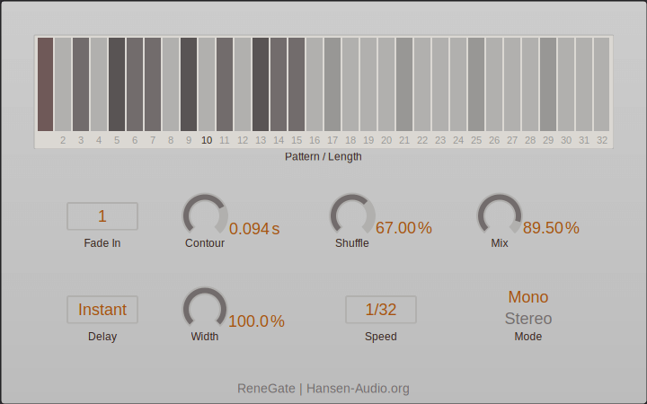

# ReneGate Effect Plug-in

[](https://github.com/hansen-audio/renegate-fx/actions/workflows/cmake.yml)

## Introduction

A VST 3 trance gate plug-in, which is supposed to work in VST 3 Hosts like Steinberg Cubase/Nuendo/WaveLab, Presonus Studio One, reaper etc.

> Disclaimer: Though fully functional this plug-in is more like a playground for trying out new things.



## Getting Started

This project's algorithms are written in Rust. In order to compile Rust code successfully, Rust needs to be installed.

> Follow instructions from here: https://www.rust-lang.org/tools/install

To clone and create the project, open a command prompt and proceed as follows:

### Linux

```
git clone https://www.github.com/hansen-audio/renegate-fx.git
mkdir build
cd build
cmake -DCMAKE_BUILD_TYPE=Debug ../renegate-fx
cmake --build .
```

### macOS

```
git clone https://www.github.com/hansen-audio/renegate-fx.git
mkdir build
cd build
cmake -GXcode ../renegate-fx
cmake --build .
```

### Windows

```
git clone https://www.github.com/hansen-audio/renegate-fx.git
mkdir build
cd build
cmake ../renegate-fx
cmake --build .
```

### Build the installer

```console
cpack -C Release -G [INNOSETUP|TGZ|productbuild] .
```

## Getting Help

* [vstdev.org](https://vstdev.org)

## Copyright & Trademark Acknowledgement 


